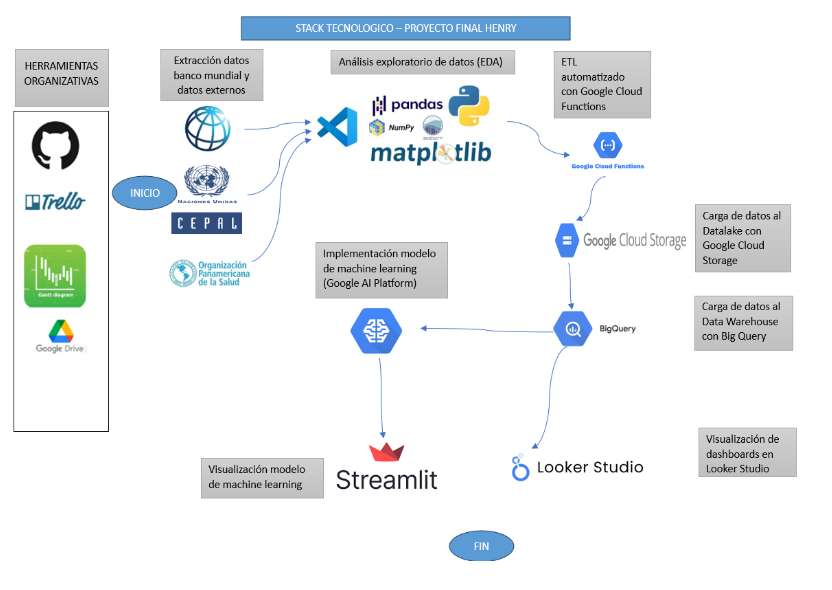
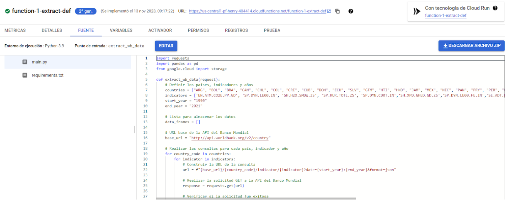
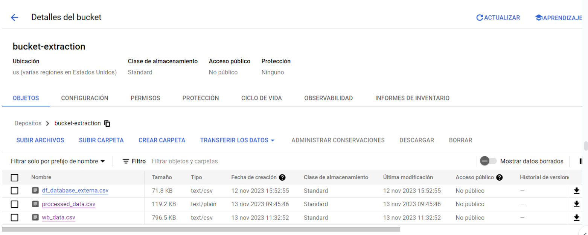
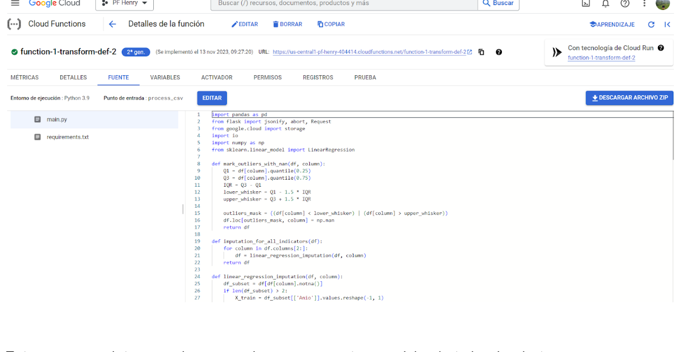
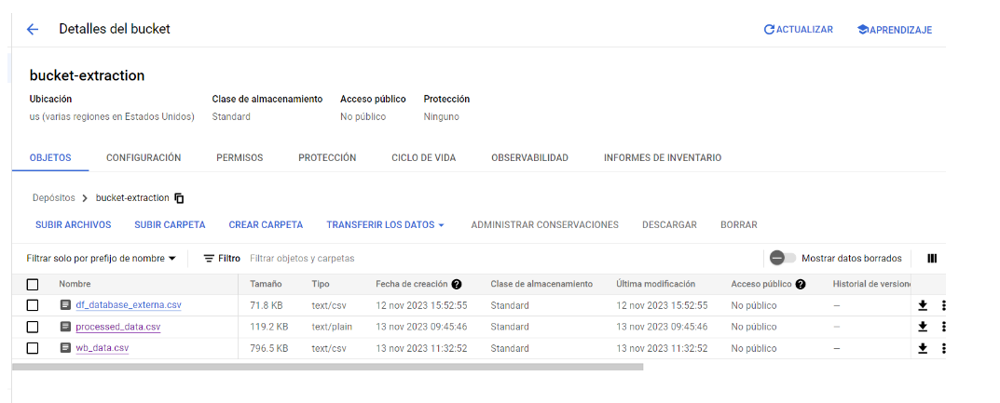
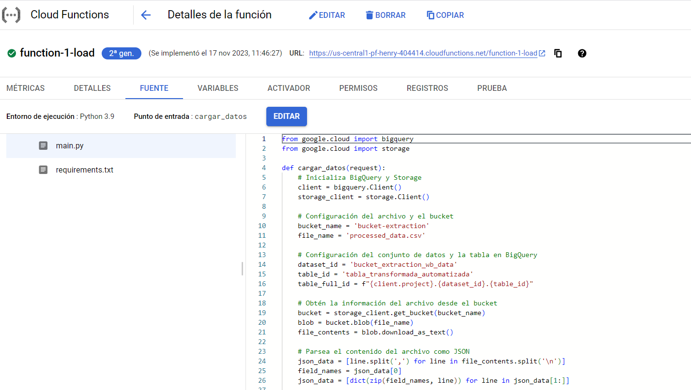
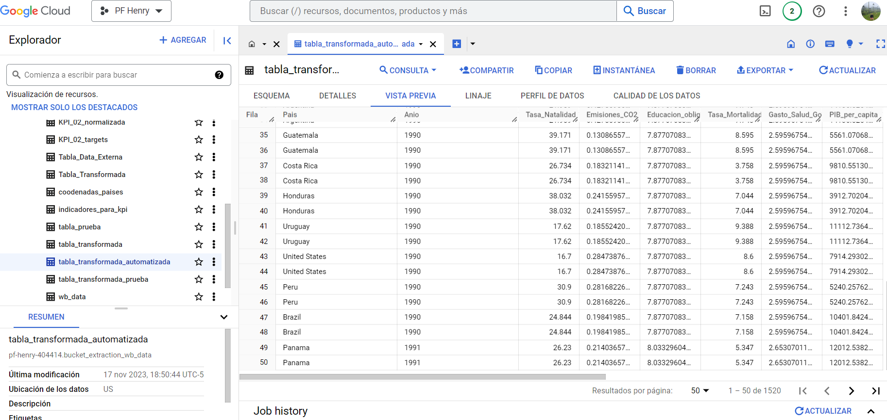
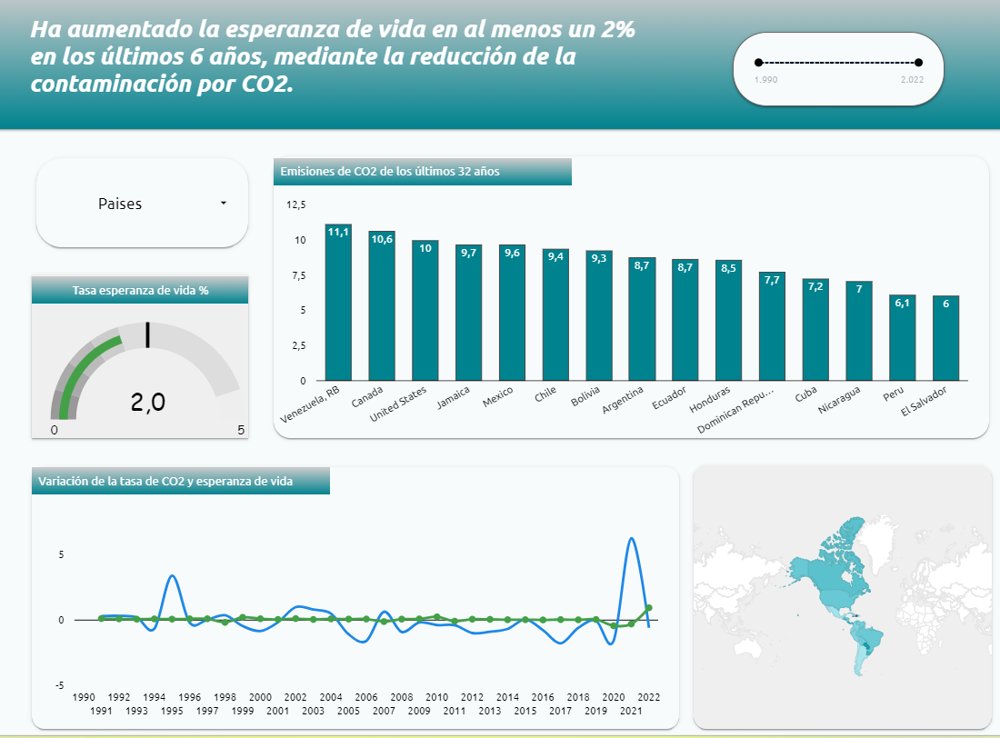
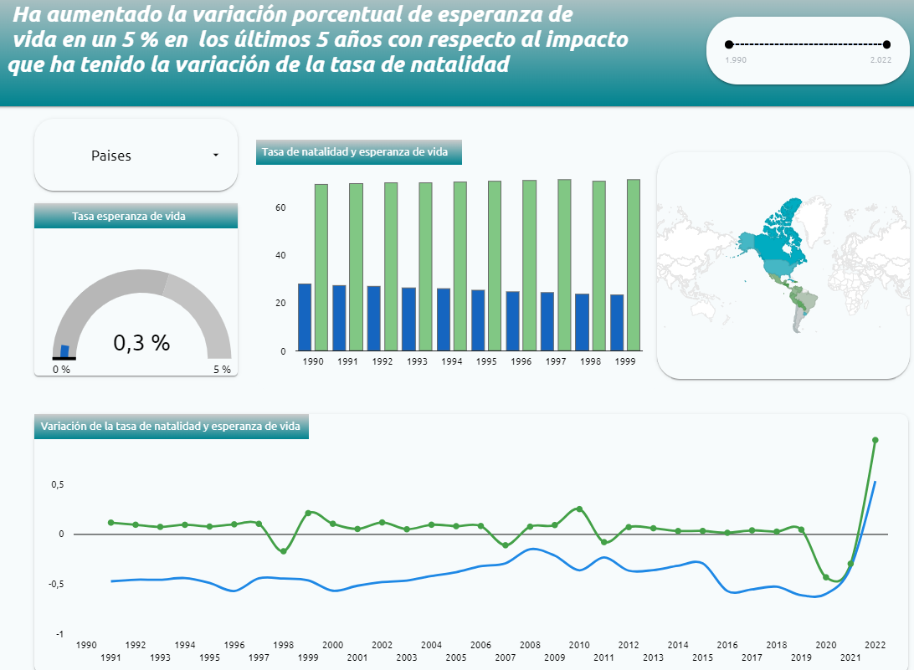
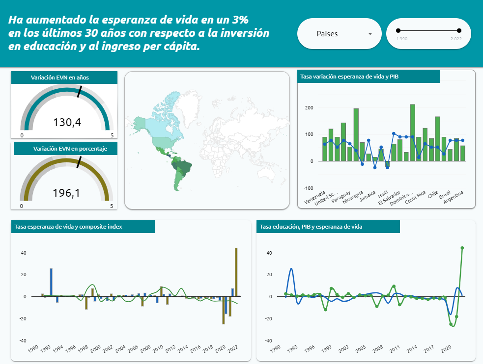

# PROYECTO FINAL - HENRY LABS

## Tabla de Contenido

- [Introducción](#introducción)
- [Objetivos](#objetivo-general)
- [Objetivos Específicos](#objetivos-específicos)
- [Alcance del Proyecto](#alcance-del-proyecto)
- [Equipo de Trabajo](#equipo-de-trabajo)
- [Stack Tecnológico](#stack-tecnológico)
- [Explicación y Uso del Repositorio](#explicación-del-repositorio)
- [Desarrollo General del Proyecto](#desarrollo-general-del-proyecto)
    - [EDA (Análisis Exploratorio de Datos)](#eda-análisis-exploratorio-de-datos)
    - [Planteamiento KPI'S](#planteamiento-kpis)
    - [Implementación ETL Automatizado en la Nube con GCP](#implementación-etl-automatizado-en-la-nube-con-gcp)
    - [Generación de Dashboards en Looker Studio](#generación-de-dashboards-en-looker-studio)
    - [Implementación Modelo de Machine Learning](#implementación-modelo-de-machine-learning)
- [Documentación Oficial del Proyecto](#documentación-oficial-del-proyecto)
- [Video Oficial del Proyecto](#video-oficial-del-proyecto)

## Introducción
Somos una consultora de datos llamada LatAm-Data Consulting encargada de realizar proyectos de data science sobre cualquier ámbito o sector que las empresas públicas o privadas deseen desarrollar con el fin de brindar herramientas para que tomen las mejores decisiones empresariales o corporativas basadas en datos (data-driven), estas decisiones contribuirán aumentar la eficiencia en todos los procesos con los que cuente la empresa (predicciones y pronóstico, medición de rendimientos, identificar oportunidades de negocio, análisis de competencia, reducción de riesgos, experiencia al cliente e innovación).

Para el presente proyecto el propósito es trabajar en colaboración con entidades gubernamentales para mejorar la calidad de vida de las personas, aumentar los niveles de esperanza de vida y fomentar la salud y el bienestar a nivel global. Ésto se realizará mediante un proyecto de data science completo en donde se involucren procesos de data engineering, data analytics y machine learning; basados principalmente en un dataset del Banco Mundial y otras fuentes de interés que proporcionen datos de calidad con el fin de realizar un ciclo de vida de dato completo y llegar a la resolución de los objetivos planteados.

## Objetivo General
Brindar un servicio de consultoría para los gobiernos de los paises de la OEA con el fin de que desarrollen políticas públicas de acuerdo al impacto que han tenido las variables socioeconómicas en la esperanza de vida de la población.

## Objetivos Específicos
* Extraer, limpiar,  procesar y  analizar datos demográficos, sociales, económicos y de salud de los países de la OEA para comprender las tendencias actuales en el indicador de esperanza de vida y cómo impactan cada una de las variables seleccionadas en este indicador.

* Identificar factores determinantes que influyen en la esperanza de vida de la población como la nutrición, el acceso a la atención médica, el entorno social y económico.

* Realizar un análisis exhaustivo de datos por países y por indicadores que nos permita identificar patrones de comportamiento, tendencias, relaciones y calcular pos KPI

* Plantear KPI 'S que permitan medir y evaluar el desempeño de las variables seleccionadas en los sectores gubernamentales y qué impacto están teniendo en la esperanza de vida en los países de la OEA.

* Proponer estrategias para aumentar los índices de esperanza de vida en la población de los países de la OEA

* Proponer un modelo de machine learning que permita resolver una problemática identificada en el proceso de data analytics. Este modelo requerirá de los pasos de selección del modelo, entrenamiento y evaluación 

* Automatizar el ciclo de vida del dato mediante Google Cloud Platform en donde se implementará pipelines automatizados de extracción, transformación y carga de datos para finalmente visualizar los reportes de los KPI 'S planteados.

## Alcance del Proyecto
Para el presente proyecto abordaremos los países que conforman la Organización de Estados Americanos (OEA), dejando para un proyecto posterior el análisis de un proyecto que englobe países de diferentes continentes. Adicional el rango de años seleccionado para el proyecto es de 32 años (1990-2022).

A través de un proceso de selección, se pre seleccionarán primero más de 50 indicadores de los sectores de las bases más confiables de los organismos internacionales especializados en el tema, que tienen que ver con el crecimiento económico, demográfico y con el desarrollo de los países, de los sectores salud, educación, economía, hábitos y bienestar, medio ambiente, nivel de vida, y condiciones financieras, entre otros.

Luego, como resultado de filtrar los datos a través de nuestro modelo específicamente diseñado, se tendrán en cuenta únicamente las variables o indicadores más significativos de cada sector que impacten de manera contundente en la esperanza de vida de la población.

Las bases de datos que se abordarán son del Banco Mundial, Naciones Unidas, Organización Mundial de la Salud, y Cepal.

## Equipo de Trabajo
Contamos con un excelente equipo de profesionales con amplios conocimientos en el campo de análisis de datos.
* Brenda Schutt, (Data Analytics, Data Scientist)
* Mara Laudonia (Data Analytics, Data Scientist)
* Haider Infante Rey, (Data Engineer, Data Scientist)

## Stack Tecnológico
El stack tecnológico utilizado para este proyecto fue el siguiente:

## Explicación del Repositorio

## Desarrollo General del Proyecto

### EDA (Análisis Exploratorio de Datos)

* **Estado de la base de datos:** las bases de datos son relativamente limpias y confiables en cuanto a los valores de los indicadores. Las bases iniciales que utilizamos fueron del Banco Mundial, específicamente en los datasets World Development Indicators (WEI) y Health, Nutrition and Population Indicators (HNPI) . De acuerdo a la disponibilidad de los datos y al análisis preliminar, se decidió trabajar, extraer datos y procesar los datos como series temporales del período mencionado a (1990-2022), de cada indicador que eventualmente pueda tener incidencia en la Esperanza de Vida, clasificados por país (De la región de la OEA)

* **Datos extraídos:** en el análisis preliminar pre seleccionamos más de 50 indicadores. Para determinar el criterio de selección de los factores socioeconómicos que más podían incidir en la EV nos valimos inicialmente de las tesis de Economía de David Rodriguez, y luego fuimos profundizando a medida que íbamos analizando la data, para incorporar más indicadores y fuentes externas al Banco Mundial, como la Cepal, Naciones Unidas, y la Organización Mundial de la Salud.

* **Filtros y reorganización de los datos:** hicimos un primer filtro de nulos, con indicadores que no tenían prácticamente data para casi ningún país y, aplicamos filtro de registros duplicados. Nos quedamos con aproximadamente 48 indicadores, agrupados por país y por año, para crear las series temporales. También pasamos un filtro a la base de datos por cantidad de población por país, ya que detectamos que los países con poblaciones menores a 2 millones, que generalmente eran las islas del Caribe pequeñas y medianas, evidenciaban una mayor carencia de datos, que podían alterar la calidad de la data obtenida. Nos quedamos entonces con la lista de países de las OEA con una población mayor a 2 millones de habitantes. 

* **Detección de Nulos:** luego hicimos una nueva detección de nulos, en este caso pivotando los datos de las tablas extraídas, para analizar los nulos de las series de tiempo de los indicadores de cada país. Esta forma de presentar los datos nos permitió comprobar que la mayoría de los nulos (o ceros), tenían que ver más que nada con falta de datos en el principio de la serie, que se denotaron en indicadores de desarrollo más específicos, o bien al final de la serie, por falta de carga de datos. Pero en ningún caso el umbral de nulos superó el 25% y por tanto dejamos los nulos y los registros para luego hacer tratamiento, ya que la data disponible, aunque dispar en los registros, es valiosa para obtener información y relaciones en cada país

* **Outliers:** se buscaron outliers, por  indicador y por país. Se observa que la mayoría de los outliers no son por mala entrada de carga de datos, sino por falta de datos, en algunos años, por ejemplo, el número cero es con frecuencia un outlier, que aparece a principio de cada serie de indicador por país, evidenciando la falta de algunos indicadores sociales antes del año 2000 (en la mayoría de los casos donde se detectaron outliers). 
En otros casos, evidenciaron una eventual particularidad de un país como una crisis económica con un salto en algún indicador (por ejemplo en el 2001, el dato de desempleo para Argentina, cuando ocurrió la crisis y el default del 2001).
En otros, claramente algún error -aunque muy pocos), como ser la EV de República Dominicana, que se sitúa cercana a los 140 años.
Se decidió por tanto, dejar los outliers para no eliminar los registros y luego reemplazarlos por data más cercana a la realidad,  rellenar los nulos con el cero, para eventuales cálculos posteriores.

* **Tratamientos de nulos y outliers:** luego, en una segunda instancia, se decidió rellenar los outliers y los nulos utilizando la técnica de un modelo de regresión, por tratarse de series de tiempo. Esto lo hicimos así, porque consideramos que desde que existe la data, puede explicar fuertemente el futuro modelo de los mayores factores socioeconómicos que inciden en la esperanza de vida para ese país en particular.

* **Gráficos:** comenzamos con gráficas las tendencias de los indicadores. Luego graficamos en un boxplot los outliers, y realizamos la regresión lineal para reemplazar los outliers y luego graficamos las tendencias de los indicadores, con los datos nuevos corregidos por el modelo.
Realizamos las regresiones para los 50 indicadores por cada país analizado, en total 35.

* **Correlaciones:** hicimos una tabla de correlaciones con las series temporales corregidas por el modelo de regresión  y graficamos las correlaciones que existen entre cada indicador (50) con la esperanza de vida, por país. Luego acotamos el análisis a los indicadores que tienen las 15 correlaciones más altas con la esperanza de vida, por país, con el objetivo de determinar las primeras relaciones que nos permitan determinar los factores socioeconómicos que más inciden en la esperanza de Vida de los países analizados de la OEA.

### Planteamiento KPI'S

* **1er KPI:** Aumentó la esperanza de vida en al menos un 2 % en los últimos 6 años, mediante la reducción de la contaminación por CO2.

* **2do KPI:** Aumentó la variación porcentual anual de esperanza de vida en los países que conforman la OEA un 5 % los últimos 5 años con respecto al impacto que ha tenido la variación anual porcentual de la tasa de natalidad.

* **3er KPI:** Aumentó la esperanza de vida en un 3% en los últimos 30 años con respecto a la inversión en educación y al ingreso per cápita.

### Implementación ETL Automatizado en la Nube con GCP
**Extracción de datos** 

Para realizar la extracción automatizada de los datos se hizo uso del servició de Google Cloud Platform llamado Cloud Functions, en esta google function llamada ‘function-1-extract-def’ se realizó la extracción de datos automática mediante la consulta a la base de datos del World Bank, esta extracción se basó en el análisis exploratorio inicial que se hizo de al menos 50 indicadores del World Bank.
Este código puede ser encontrado en el repositorio del proyecto en el notebook ‘06.implementacion_gcp’ en el apartado de ‘extracción de datos’.

Una vez realizada esta extracción automática, la información queda contenida en un archivo csv, el cual queda guardado en un bucket de Google Cloud Storage llamado ‘wb_data’.

**Transformación de datos** 

Una vez realizada toda la extracción se procede a transformar los datos y seguidamente a cargarlos, nuevamente con la implementación de una Cloud Function llamada ‘function-1-transform-def-2’ se logra realizar la transformación de los datos. Este código puede ser encontrado en el repositorio del proyecto en el notebook ‘06.implementacion_gcp’ en el apartado de ‘transformación de datos’.

Estos nuevos datos quedan cargados nuevamente en el bucket de cloud storage en un archivo llamado ‘processed_data.csv’ como se muestra en la siguiente imagen.

**Carga de datos** 

Para cargar los datos al data warehouse usamos otra google cloud function llamada “function-1-load” la cual toma el archivo “proccesed_data.csv”, él cual está en un bucket de cloud storage y directamente crea la tabla en bigquery lista para ser consumida por medio de consultas sql o mediante transformación adicionales en los notebooks de bigquery.

Este código puede ser encontrado en el repositorio del proyecto en el notebook ‘06.implementacion_gcp’ en el apartado de ‘carga de datos’.

## Producto Final del Proyecto

### Dashboards en Looker Studio
Una vez el data warehouse esté cargado en BigQuery se procede a realizar los dashboards para cada uno de los KPI ‘S propuestos anteriormente mediante el servicio de Looker Studio, el cual es un servicio que se encuentra dentro de la plataforma Google Cloud Platform.

**KPI # 1**

**KPI # 2**

**KPI # 3**

### Deployment Modelo de Machine Learning
Por medio del data warehouse cargado en BigQuery se procede a realizar todo el proceso de modelado del modelo de machine learning, este archivo se encuentra en la sección 'Notebooks_ML/ML_final_seleccion_prediccion.ipynb' del presente repositorio.
Una vez realizado el modelo se procede a implementar por medio de la libreria streamlit todo el proceso para ser deployado en la web, este codigo es encontrado en el archivo 'app.py'del presente proyecto; para que este archivo funcione correctamente se debe crear tambien un archivo 'app.yaml' y 'requirements.txt' contenidos tambien en el actual repositorio en la carpeta raíz.

Una vez realizado toda la implementación de streamlit se procede a cargar el repositorio a GitHub, que es de donde se va a deployar, para hacer este deploy se hace uso del aplicativo 'share.streamlit.io' para finalmente ser mostrado en la web de manera online e interactiva y que se encuentra alojado en [este enlace](https://proyectofinalbootcamphenry-nkd7h3fumgqju7zsfsnsiv.streamlit.app/).

**Deployment en la web**

## Documentación Oficial del Proyecto
La Documentación oficial del proyecto la pueden encontrar en el siguiente enlace: [Documentación Oficial](https://docs.google.com/document/d/1tasQgqrHd8O3r5we7FaN1J7Qnps3nfe9UmtfKFxx0hs/edit?usp=sharing).

## Video Oficial del Proyecto
El video completo del proyecto se encuentra alojado en [este enlace]().